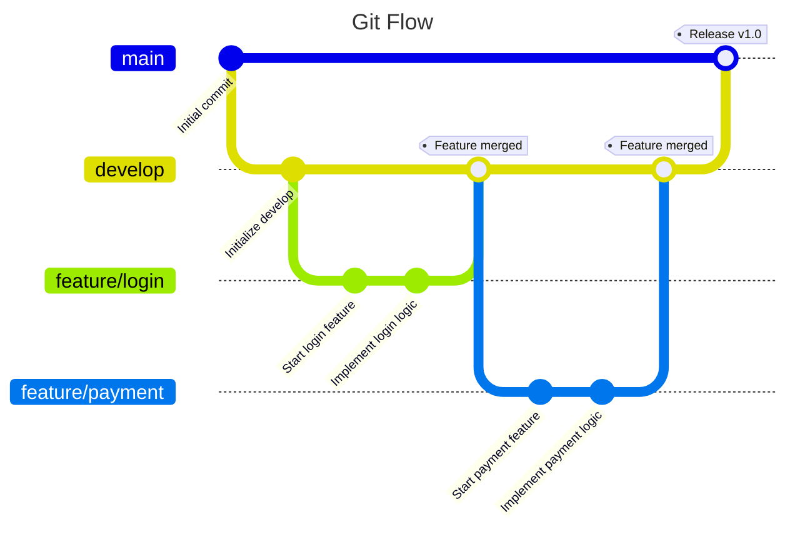

# Charlee

### Git branch 전략

```mermaid
---
title: Git Flow
---
gitGraph
    commit id: "Initial commit"
    branch develop
    commit id: "Initialize develop"
    branch feature/login
    commit id: "Start login feature"
    commit id: "Implement login logic"
    checkout develop
    merge feature/login tag: "Feature merged"
    branch feature/payment
    commit id: "Start payment feature"
    commit id: "Implement payment logic"
    checkout develop
    merge feature/payment tag: "Feature merged"
    checkout main
    merge develop tag: "Release v1.0"
```
