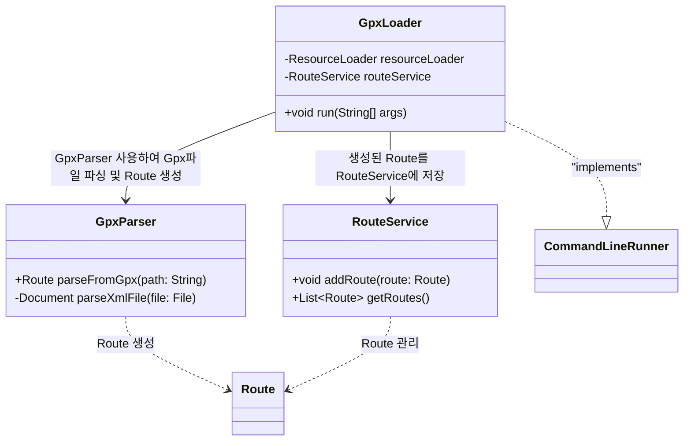

```mermaid
classDiagram
    class GpxParser {
      +Route parseFromGpx(path: String)
      -Document parseXmlFile(file: File)
    }

    class RouteService {
      +void addRoute(route: Route)
      +List~Route~ getRoutes()
    }

    class GpxLoader {
      +void run(String[] args)
      -ResourceLoader resourceLoader
      -RouteService routeService
    }

    GpxLoader ..|> CommandLineRunner : "implements"
    GpxLoader --> GpxParser : GpxParser 사용하여 Gpx파일 파싱 및 Route 생성
    GpxLoader --> RouteService : 생성된 Route를 RouteService에 저장
    GpxParser ..> Route : Route 생성
    RouteService ..> Route : Route 관리
```
