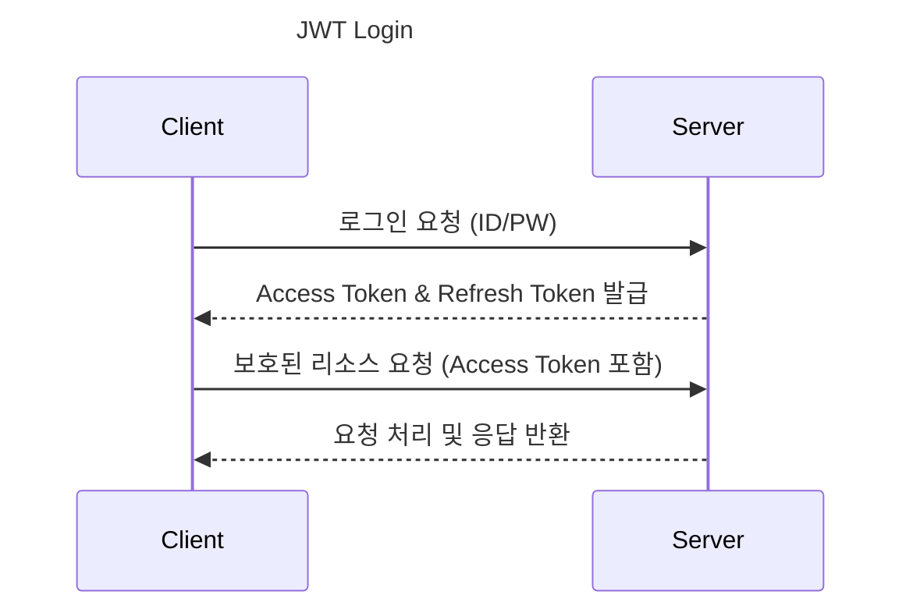
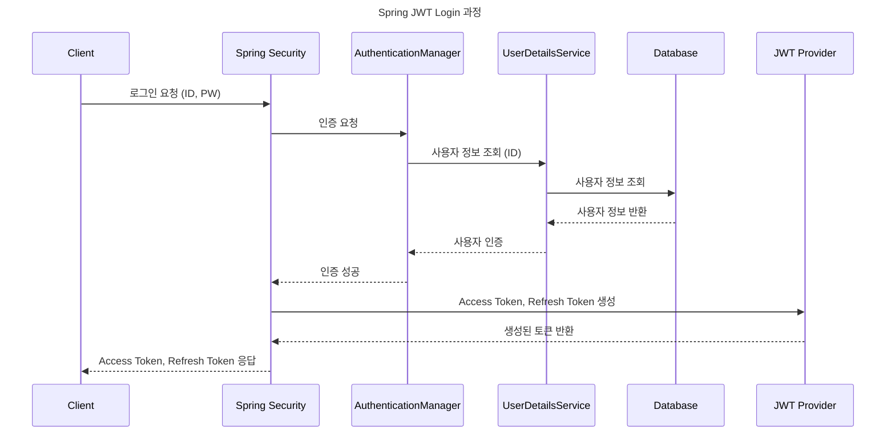
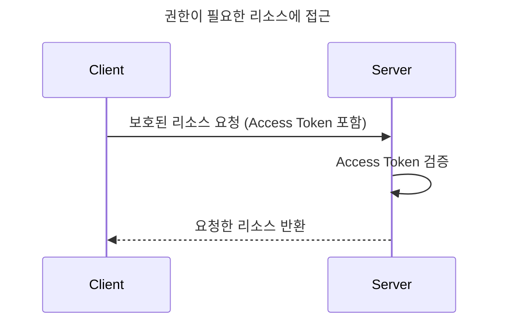
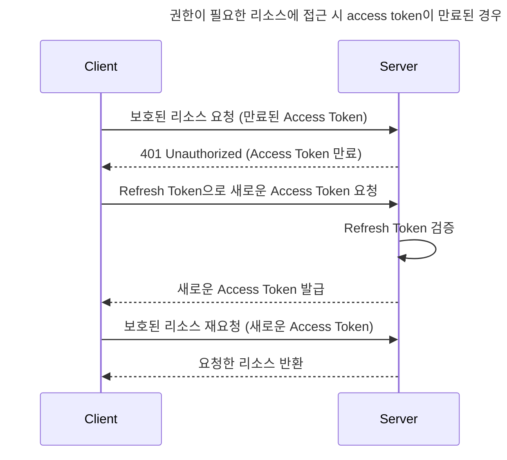
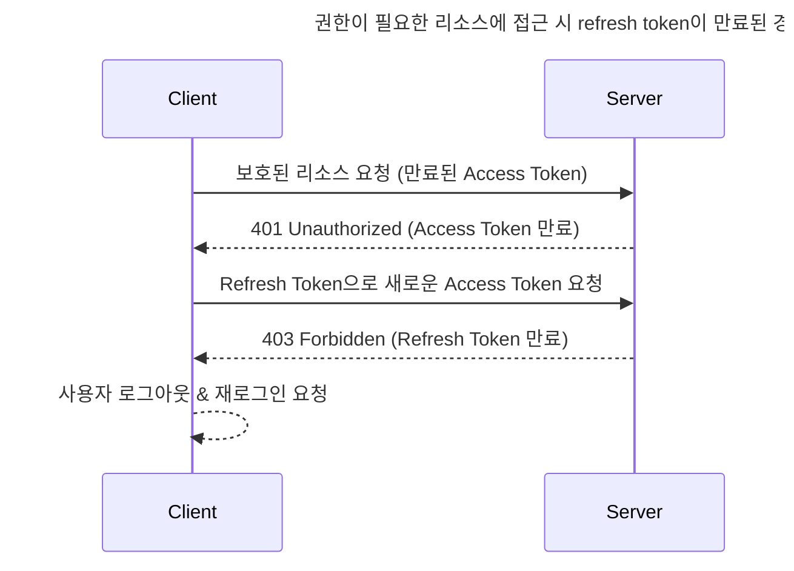
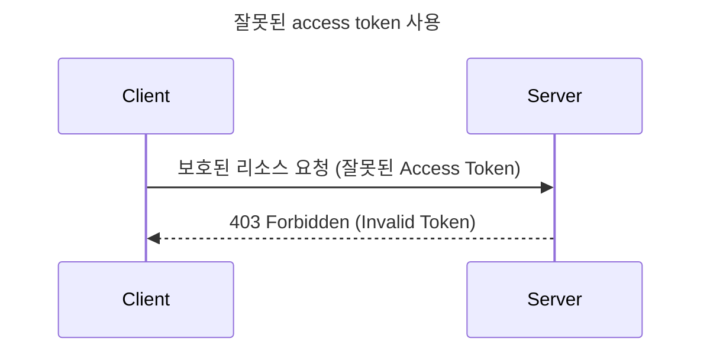
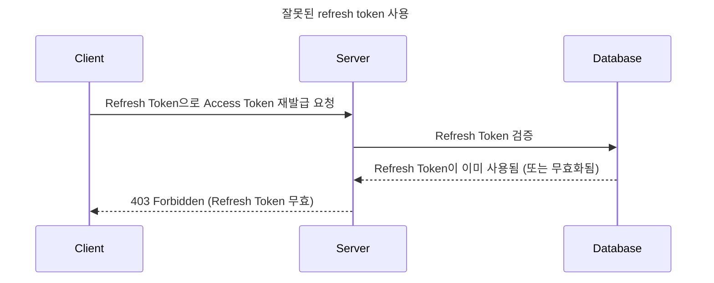
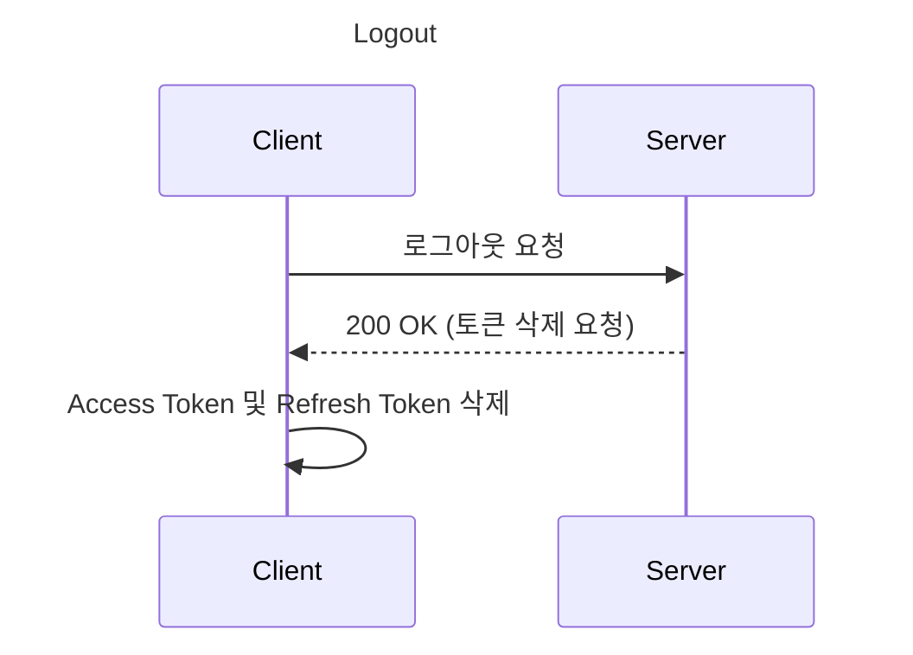
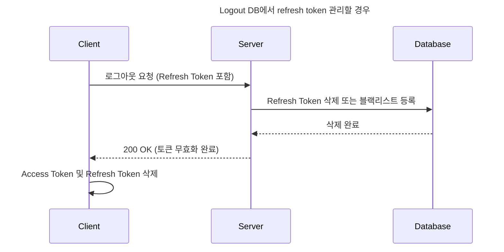

```mermaid
---
title: JWT Login
---
sequenceDiagram
    participant Client
    participant Server
    Client ->> Server: 로그인 요청 (ID/PW)
    Server -->> Client: Access Token & Refresh Token 발급
    Client ->> Server: 보호된 리소스 요청 (Access Token 포함)
    Server -->> Client: 요청 처리 및 응답 반환
```

```mermaid
---
title: Spring JWT Login 과정
---
sequenceDiagram
    participant Client
    participant Spring Security
    participant AuthenticationManager
    participant UserDetailsService
    participant Database
    participant JWT Provider
    Client ->> Spring Security: 로그인 요청 (ID, PW)
    Spring Security ->> AuthenticationManager: 인증 요청
    AuthenticationManager ->> UserDetailsService: 사용자 정보 조회 (ID)
    UserDetailsService ->> Database: 사용자 정보 조회
    Database -->> UserDetailsService: 사용자 정보 반환
    UserDetailsService -->> AuthenticationManager: 사용자 인증
    AuthenticationManager -->> Spring Security: 인증 성공
    Spring Security ->> JWT Provider: Access Token, Refresh Token 생성
    JWT Provider -->> Spring Security: 생성된 토큰 반환
    Spring Security -->> Client: Access Token, Refresh Token 응답

```

```mermaid
---
title: 권한이 필요한 리소스에 접근
---
sequenceDiagram
    participant Client
    participant Server
    Client ->> Server: 보호된 리소스 요청 (Access Token 포함)
    Server ->> Server: Access Token 검증
    Server -->> Client: 요청한 리소스 반환
```

```mermaid
---
title: 권한이 필요한 리소스에 접근 시 access token이 만료된 경우
---
sequenceDiagram
    participant Client
    participant Server
    Client ->> Server: 보호된 리소스 요청 (만료된 Access Token)
    Server -->> Client: 401 Unauthorized (Access Token 만료)
    Client ->> Server: Refresh Token으로 새로운 Access Token 요청
    Server ->> Server: Refresh Token 검증
    Server -->> Client: 새로운 Access Token 발급
    Client ->> Server: 보호된 리소스 재요청 (새로운 Access Token)
    Server -->> Client: 요청한 리소스 반환
```

```mermaid
---
title: 권한이 필요한 리소스에 접근 시 refresh token이 만료된 경우
---
sequenceDiagram
    participant Client
    participant Server
    Client ->> Server: 보호된 리소스 요청 (만료된 Access Token)
    Server -->> Client: 401 Unauthorized (Access Token 만료)
    Client ->> Server: Refresh Token으로 새로운 Access Token 요청
    Server -->> Client: 403 Forbidden (Refresh Token 만료)
    Client -->> Client: 사용자 로그아웃 & 재로그인 요청
```

```mermaid
---
title: 잘못된 access token 사용
---
sequenceDiagram
    participant Client
    participant Server
    Client ->> Server: 보호된 리소스 요청 (잘못된 Access Token)
    Server -->> Client: 403 Forbidden (Invalid Token)
```

```mermaid
---
title: 잘못된 refresh token 사용
---
sequenceDiagram
    participant Client
    participant Server
    participant Database
    Client ->> Server: Refresh Token으로 Access Token 재발급 요청
    Server ->> Database: Refresh Token 검증
    Database -->> Server: Refresh Token이 이미 사용됨 (또는 무효화됨)
    Server -->> Client: 403 Forbidden (Refresh Token 무효)
```

```mermaid
---
title: Logout
---
sequenceDiagram
    participant Client
    participant Server
    Client ->> Server: 로그아웃 요청
    Server -->> Client: 200 OK (토큰 삭제 요청)
    Client ->> Client: Access Token 및 Refresh Token 삭제
```

```mermaid
---
title: Logout DB에서 refresh token 관리할 경우
---
sequenceDiagram
    participant Client
    participant Server
    participant Database
    Client ->> Server: 로그아웃 요청 (Refresh Token 포함)
    Server ->> Database: Refresh Token 삭제 또는 블랙리스트 등록
    Database -->> Server: 삭제 완료
    Server -->> Client: 200 OK (토큰 무효화 완료)
    Client ->> Client: Access Token 및 Refresh Token 삭제
```
